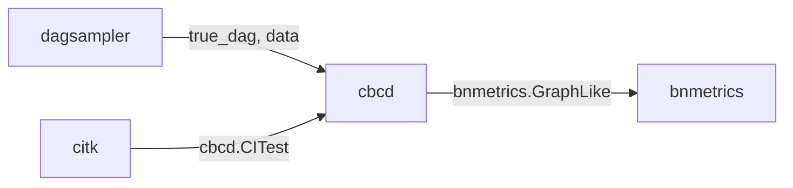

# Constraint-Based Causal Discovery Suite

A four-package Python suite for constraint-based causal discovery —
simulation, conditional independence testing, structure learning, and
metric / visualisation. Each package is independent and stands on its
own; cross-package interoperability is via structural Protocols, not
imports.

Full [documentation](https://averinpa.github.io/constraint-based-causal-discovery-suite/) is hosted on GitHub Pages.

## Packages

| package | purpose | status | docs |
|---|---|---|---|
| **[`dagsampler`](dagsampler/)** | Configurable DAG / SCM simulator producing synthetic mixed-type data and an optional CI oracle. | v0.2.0, on PyPI | [docs](https://averinpa.github.io/constraint-based-causal-discovery-suite/dagsampler/) |
| **[`cbcd`](cbcd/)** | Constraint-based causal discovery algorithms: PC, FCI, RFCI, anytime-FCI, PCMCI. | v0.1.0, not yet on PyPI | [docs](https://averinpa.github.io/constraint-based-causal-discovery-suite/cbcd/) |
| **[`citk`](citk/)** | Conditional independence test toolkit: FisherZ and Spearman native; KCI / CMIknn / RegressionCI / GCM and others via optional extras. | v0.1.0, not yet on PyPI | [docs](https://averinpa.github.io/constraint-based-causal-discovery-suite/citk/) |
| **[`bnmetrics`](bnmetrics/)** | DAG / CPDAG / PAG comparison metrics and visualisation: SHD, HD, F1, SID, per-Markov-blanket comparisons. | v0.2.2 (in development), not yet on PyPI | [docs](https://averinpa.github.io/constraint-based-causal-discovery-suite/bnmetrics/) |

## Architecture

The four packages communicate only through **structural Protocols**
(PEP 544 — small interfaces that any conforming object satisfies, no
inheritance required). citk's CI tests and the graphs that cbcd and
dagsampler produce cross package boundaries via these Protocols, so
no package imports another at runtime. Each piece can therefore be
installed and updated independently.



| data flow | Protocol |
|---|---|
| `citk → cbcd` | `cbcd.CITest` |
| `cbcd → bnmetrics`, `dagsampler → bnmetrics` | `bnmetrics.GraphLike` |

dagsampler additionally exposes an optional CI oracle (via
`CausalDataGenerator.as_ci_oracle()`) that conforms to `cbcd.CITest`
— useful when you want d-separation testing alongside simulated
data, but not part of the standard simulate → recover → compare
pipeline.

## Installation

Each package installs independently. `dagsampler` is on PyPI; the
other three install from this monorepo via `git+https`:

```bash
uv pip install \
  dagsampler \
  "cbcd @ git+https://github.com/averinpa/constraint-based-causal-discovery-suite#subdirectory=cbcd" \
  "citk @ git+https://github.com/averinpa/constraint-based-causal-discovery-suite#subdirectory=citk" \
  "bnmetrics @ git+https://github.com/averinpa/constraint-based-causal-discovery-suite#subdirectory=bnmetrics"
```

(Replace `uv pip` with `pip` if you don't use `uv`. Per-package
READMEs document optional extras — kernel- and ML-based CI tests in
`citk`, visualisation in `bnmetrics`.)

## Quick start

```python
from dagsampler import CausalDataGenerator
from citk.tests.partial_correlation_tests import FisherZ
from cbcd import pc
import bnmetrics

# 1. Simulate a DAG and data, and grab a d-separation CI oracle.
gen = CausalDataGenerator({
    "simulation_params": {"n_samples": 3000, "seed_structure": 1,
                          "seed_data": 2, "binary_proportion": 0.0},
    "graph_params": {"type": "custom",
                     "nodes": ["A", "B", "C"],
                     "edges": [["A", "C"], ["B", "C"]]},  # collider A → C ← B
})
result = gen.simulate()

# 2. Recover the CPDAG twice: once with dagsampler's oracle (gold standard),
#    once with citk's FisherZ on the simulated data (empirical method).
true_cpdag = pc(result["data"], ci_test=gen.as_ci_oracle(),     alpha=0.05)
recovered  = pc(result["data"], ci_test=FisherZ(result["data"].to_numpy()), alpha=0.05)

# 3. Score the empirical recovery against the gold standard.
print("SHD:", bnmetrics.shd(true_cpdag, recovered))   # 0
print("F1: ", bnmetrics.f1 (true_cpdag, recovered))   # 1.0
```

The full walkthrough — per-line breakdown, visualisation, and a
noisier 4-node example — is at [`docs/tutorial.md`](docs/tutorial.md).

## Development

Each package has its own `uv` environment; there's no shared venv:

```bash
cd dagsampler && uv sync --all-extras && uv run pytest
cd cbcd       && uv sync --all-extras && uv run pytest
cd citk       && uv sync --all-extras && uv run pytest
cd bnmetrics        && uv sync --all-extras && uv run pytest
```

The suite-level integration harness chains all four packages on a
5-fixture set (`collider_3`, `fork_3`, `chain_3`, `diamond_4`,
`asia_like_5`) and asserts per-fixture SHD/F1 bounds:

```bash
cd parity/suite && uv sync && uv run python run.py
```

A failure there means either a numerical regression or a broken
Protocol contract between the packages.

## License and prior art

All suite-level and per-package content is [MIT-licensed](LICENSE).

Prior-art relationships, attribution for upstream sources
(`causal-learn`, `tigramite`, `DAGMetrics`, `mCMIkNN`), and the
GPL-3 boundary for tigramite-based optional extras are documented in
[`NOTICE.md`](NOTICE.md).
