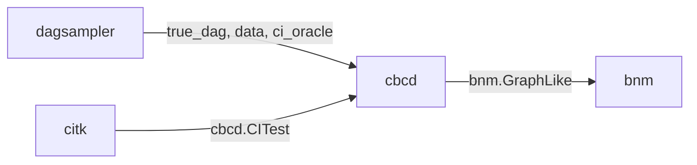

# Constraint-Based Causal Discovery Suite

A four-package Python suite for constraint-based causal discovery —
simulation, conditional independence testing, structure learning, and
metric / visualisation. Each package is independent and stands on its
own; cross-package interoperability is via structural Protocols, not
imports.

Full [documentation](https://averinpa.github.io/constraint-based-causal-discovery-suite/) is hosted on GitHub Pages.

## Packages

| package | purpose | status | docs |
|---|---|---|---|
| **[`dagsampler`](dagsampler/)** | Configurable DAG / SCM simulator producing synthetic mixed-type data and an optional CI oracle. | v0.2.0, on PyPI | [docs](https://averinpa.github.io/constraint-based-causal-discovery-suite/dagsampler/) |
| **[`cbcd`](cbcd/)** | Constraint-based causal discovery algorithms: PC, FCI, RFCI, anytime-FCI, PCMCI. | v0.1.0, not yet on PyPI | [docs](https://averinpa.github.io/constraint-based-causal-discovery-suite/cbcd/) |
| **[`citk`](citk/)** | Conditional independence test toolkit: FisherZ and Spearman native; KCI / CMIknn / RegressionCI / GCM and others via optional extras. | v0.1.0, not yet on PyPI | [docs](https://averinpa.github.io/constraint-based-causal-discovery-suite/citk/) |
| **[`bnm`](bnm/)** | DAG / CPDAG / PAG comparison metrics and visualisation: SHD, HD, F1, SID, per-Markov-blanket comparisons. | v0.2.2 (in development), not yet on PyPI | [docs](https://averinpa.github.io/constraint-based-causal-discovery-suite/bnm/) |

## Architecture

Cross-package interaction passes through three structural Protocols.
No package imports another.



| boundary | contract | defined by |
|---|---|---|
| `citk → cbcd` | `cbcd.CITest` Protocol (`n_vars`, `__call__`, `details`) | `cbcd` |
| `dagsampler → cbcd` (CI oracle) | `cbcd.CITest` Protocol — `dagsampler.CausalDataGenerator.as_ci_oracle()` returns a conforming object | `cbcd` |
| `dagsampler → bnm` / `cbcd → bnm` | `bnm.GraphLike` Protocol (`n_vars`, `endpoints` int8 matrix, `var_names`) | `bnm` |

The Protocol contracts are verified at runtime in
[`parity/suite/run.py`](parity/suite/run.py); finding `from cbcd
import ...` inside `citk`, `bnm`, or `dagsampler` (or any reverse
direction) is a contract violation.

## Quick start

The end-to-end story across all four packages — `dagsampler` →
`citk` → `cbcd` → `bnm`, in roughly 10 lines — is at
[`docs/tutorial.md`](docs/tutorial.md). It runs verbatim and yields
`SHD: 0, F1: 1.0` on the canonical 3-node collider example.

Each package has its own dev environment and tooling; no shared venv:

```bash
# cbcd       (algorithms)
cd cbcd       && uv sync --all-extras && uv run pytest

# citk       (CI tests)
cd citk       && uv sync --all-extras && uv run pytest

# dagsampler (simulator)
cd dagsampler && uv sync --all-extras && uv run pytest

# bnm        (metrics + viz)
cd bnm        && uv sync --all-extras && uv run pytest
```

## Suite-level integration test

[`parity/suite/run.py`](parity/suite/run.py) chains all four packages
on a 5-fixture set (`collider_3`, `fork_3`, `chain_3`, `diamond_4`,
`asia_like_5`) and asserts per-fixture SHD/F1 bounds calibrated as a
regression detector (not an algorithmic-precision benchmark):

```bash
cd parity/suite
uv sync && uv run python run.py
```

A failure here means either a real numerical regression or a broken
Protocol contract between the packages.

## License and prior art

All suite-level and per-package content is [MIT-licensed](LICENSE).

Prior-art relationships, attribution for upstream sources
(`causal-learn`, `tigramite`, `DAGMetrics`, `mCMIkNN`), and the
GPL-3 boundary for tigramite-based optional extras are documented in
[`NOTICE.md`](NOTICE.md).
