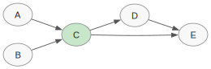
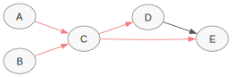
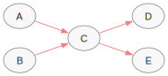
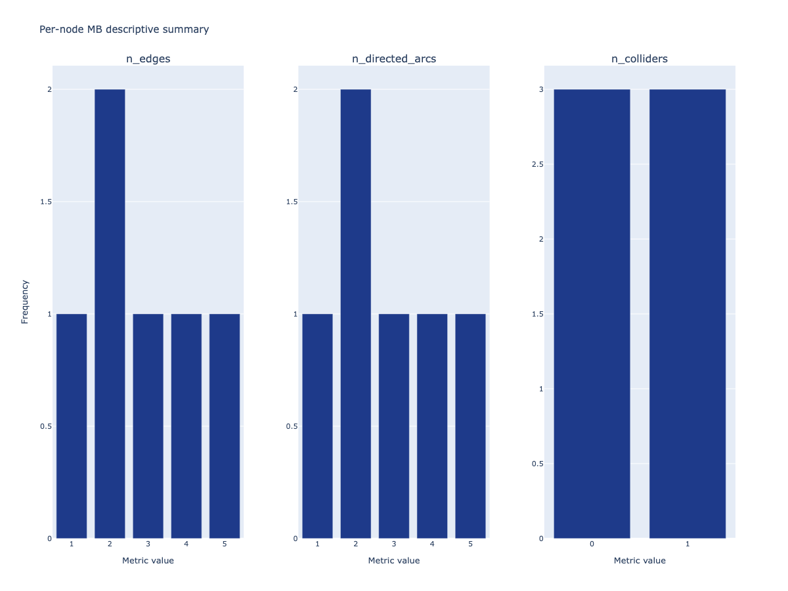

# Visualising the Markov blanket

The Markov blanket of a variable $X$ in a DAG is the set of nodes
that, when conditioned on, renders $X$ independent of every other
variable — formally, the union of its parents, children, and the
parents of its children (its *spouses*).

## Extracting the Markov blanket

`bnm.markov_blanket(g, var)` returns a sub-`GraphLike` restricted
to $\{X\} \cup \mathrm{MB}(X)$, preserving every endpoint mark
incident to those nodes. `bnm.markov_blanket_indices` returns the
indices only.

```python
import numpy as np
import bnm

# 6-node DAG: A → C, B → C, C → D, C → E, D → E, E → F
endpoints = np.zeros((6, 6), dtype=np.int8)
for i, j in [(0, 2), (1, 2), (2, 3), (2, 4), (3, 4), (4, 5)]:
    endpoints[i, j] = 2
    endpoints[j, i] = 1
g = bnm.to_graphlike(endpoints,
                     var_names=("A", "B", "C", "D", "E", "F"))

bnm.markov_blanket_indices(g, "C")     # (0, 1, 2, 3, 4)
mb_c = bnm.markov_blanket(g, "C")
mb_c.var_names                          # ('A', 'B', 'C', 'D', 'E')
```

Node `F` is excluded because it is a descendant of `E` but not a
spouse of `C`. The MB of `C` is
$\{A, B\} \cup \{D, E\} \cup \{D\} = \{A, B, D, E\}$.

## Plotting the Markov-blanket subgraph

`bnm.plot_graph` accepts the MB subgraph directly. Highlighting
the target node makes the blanket structure immediately legible:

```python
bnm.plot_graph(
    mb_c,
    title="MB(C)",
    highlight=["C"],
    direction="LR",
    save="mb_c.svg",
)
```



The `highlight` argument paints the listed nodes in a
distinguishing colour (default pastel green); every other element
follows the default style.

## Comparing two graphs on the Markov blanket of a target

When two graphs are being compared and the analysis of interest is
local to a particular variable, scope both graphs to the MB of
that target before passing them to a metric or visualiser. The
example below compares the true DAG above against a recovery that
has dropped the $D \to E$ edge:

```python
endpoints_rec = endpoints.copy()
endpoints_rec[3, 4] = 0
endpoints_rec[4, 3] = 0
g_rec = bnm.to_graphlike(endpoints_rec,
                         var_names=("A", "B", "C", "D", "E", "F"))

mb_true = bnm.markov_blanket(g,     "C")
mb_rec  = bnm.markov_blanket(g_rec, "C")

bnm.shd(mb_true, mb_rec)              # 1 — the missing D → E edge
bnm.plot_side_by_side(
    mb_true, mb_rec,
    name1="true_MB(C)", name2="recovered_MB(C)",
    direction="LR", save="mb_comparison.svg",
)
```

| true MB(C) | recovered MB(C) |
|:---:|:---:|
|  |  |

The MB-scoped SHD is identical to the global SHD here because the
dropped edge falls inside $\mathrm{MB}(C)$. In general the MB-scoped
distance is a lower bound on the global distance, and the gap
quantifies how much of the recovery error is local to the target.

## Per-node Markov-blanket summary

`bnm.analyse_mb` produces a multi-panel `plotly` figure summarising
the per-node MB descriptive metrics (one panel per variable, faceted
by metric). Each panel reports the descriptive metrics restricted to
the corresponding MB subgraph:

```python
fig = bnm.analyse_mb(
    g,
    descriptive=["n_edges", "n_directed_arcs", "n_colliders"],
    cols=3,
)
fig.write_html("mb_summary.html")
```



`descriptive` accepts either a list of metric names or the literal
string `"all"`. The figure is a standard `plotly.graph_objs.Figure`,
so it can be saved with `.write_html`, `.write_image` (requires
`kaleido`), or displayed directly in a notebook.
