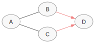
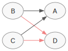
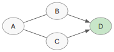
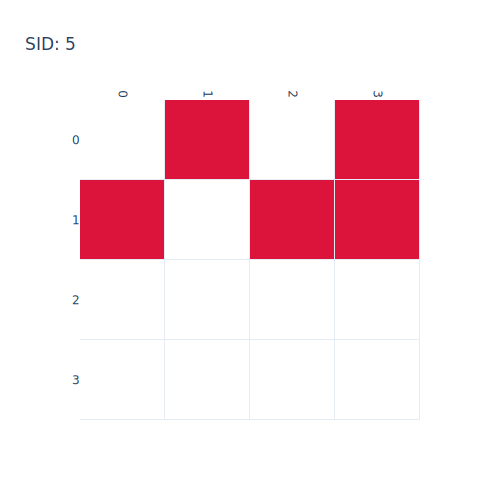

# Plotting comparisons

The `bnm.viz` functions are gated behind the optional `[viz]`
extra (`graphviz`, `plotly`, `ipython`); calling them without the
extra installed raises an `ImportError` with an actionable hint.

## Side-by-side comparison

`bnm.plot_side_by_side(g1, g2, name1=..., name2=...)` renders two
graphs as paired graphviz diagrams. Edges that match between the
two panels (same skeleton, same orientation) are highlighted in
pastel red so true positives stand out from errors:

```python
import numpy as np
import bnm

true_cpdag = bnm.to_graphlike(
    np.array([
        [0, 1, 1, 0],
        [1, 0, 0, 2],
        [1, 0, 0, 2],
        [0, 1, 1, 0],
    ], dtype=np.int8),
    var_names=("A", "B", "C", "D"),
)
recovered = bnm.to_graphlike(
    np.array([
        [0, 1, 1, 0],
        [2, 0, 0, 2],
        [2, 0, 0, 2],
        [0, 1, 1, 0],
    ], dtype=np.int8),
    var_names=("A", "B", "C", "D"),
)

bnm.plot_side_by_side(
    true_cpdag, recovered,
    name1="truth", name2="recovered",
    direction="LR",
    save="comparison.svg",
)
```

| truth | recovered |
|:---:|:---:|
|  |  |

`save` accepts either a single path (the renderer derives two
sibling filenames from `name1` and `name2`) or an explicit
`(path_left, path_right)` tuple. The `direction` argument controls
graphviz layout — `"LR"` (left-to-right) or `"TB"` (top-to-bottom).

The matched edges (`B → D` and `C → D` in this fixture) appear in
pastel red in both panels; the reversed upper edges fall back to
the default stroke.

## Single-graph rendering with highlights

`bnm.plot_graph(g, highlight=[...])` renders a single graph with
selected nodes painted in a highlight colour. This is the building
block underneath both `plot_side_by_side` and `analyse_mb`:

```python
bnm.plot_graph(true_cpdag, highlight=["D"], direction="LR",
               save="true_with_D_highlighted.svg")
```



## SID incorrect-edge heatmap

`bnm.plot_sid_matrix` renders the $(i, j)$ indicator matrix of
intervention pairs on which the recovered graph predicts a
different distribution than the reference. `bnm.sid` requires the
reference (`g1`) to be a pure DAG; the recovered graph may be a
DAG or a CPDAG (the latter yields separate lower/upper bounds).

```python
true_dag = bnm.to_graphlike(
    np.array([
        [0, 2, 2, 0],   # A → B, A → C
        [1, 0, 0, 2],   # B → D
        [1, 0, 0, 2],   # C → D
        [0, 1, 1, 0],
    ], dtype=np.int8),
    var_names=("A", "B", "C", "D"),
)
recovered_dag = bnm.to_graphlike(
    np.array([
        [0, 1, 2, 0],   # A → C, but B → A (reversed)
        [2, 0, 0, 2],
        [1, 0, 0, 2],
        [0, 1, 1, 0],
    ], dtype=np.int8),
    var_names=("A", "B", "C", "D"),
)

sid_result = bnm.sid(true_dag, recovered_dag)
sid_result.sid              # 5
bnm.plot_sid_matrix(sid_result, save="sid_matrix.html")
```



The save format is inferred from the file extension. `.html` is
the default; static-image formats (`.png`, `.svg`, `.pdf`,
`.jpg`, `.jpeg`, `.webp`) additionally require `kaleido`
(`pip install kaleido`).
