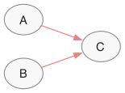
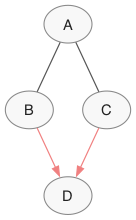
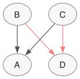

# Suite tutorial: dagsampler → citk → cbcd → bnm in 10 lines

This is the end-to-end story for the constraint-based causal-discovery
suite. Four packages, no shared types, no cross-package imports —
they meet at two structural Protocols (`cbcd.CITest` and
`bnm.GraphLike`) and that's enough.

## The 10-line story

```python
from dagsampler import CausalDataGenerator
from citk.tests.partial_correlation_tests import FisherZ
from cbcd import pc
import bnm

# 1. Simulate a DAG and data, and grab a d-separation CI oracle.
gen = CausalDataGenerator({
    "simulation_params": {"n_samples": 3000, "seed_structure": 1,
                          "seed_data": 2, "binary_proportion": 0.0},
    "graph_params": {"type": "custom",
                     "nodes": ["A", "B", "C"],
                     "edges": [["A", "C"], ["B", "C"]]},  # collider A → C ← B
})
result = gen.simulate()

# 2. Recover the CPDAG twice: once with dagsampler's oracle (gold standard),
#    once with citk's FisherZ on the simulated data (empirical method).
true_cpdag = pc(result["data"], ci_test=gen.as_ci_oracle(),     alpha=0.05)
recovered  = pc(result["data"], ci_test=FisherZ(result["data"].to_numpy()), alpha=0.05)

# 3. Score the empirical recovery against the gold standard.
print("SHD:", bnm.shd(true_cpdag, recovered))   # 0
print("F1: ", bnm.f1 (true_cpdag, recovered))   # 1.0
```

That's the whole flow. The simulator, the CI test toolkit, the
algorithm, and the metrics each live in their own package, with their
own dev environment, and none of them imports the others.

## What every line is doing

**dagsampler — the simulator.**
`CausalDataGenerator(cfg).simulate()` builds a `networkx.DiGraph`
DAG, samples mixed-type data conforming to the configured noise and
mechanism choices, and returns both as a dict.
`gen.as_ci_oracle()` (added in 0.2.0) returns a `DSeparationOracle`
that answers `x ⫫ y | S` queries by d-separation on the generated
graph — a `p`-value of `1.0` for d-separated pairs, `0.0` otherwise.

**citk — the CI test toolkit.**
`citk.tests.partial_correlation_tests.FisherZ(data)` is a native
partial-correlation test for continuous Gaussian data. citk's
`CITKTest` base class exposes `n_vars`, `__call__(X, Y, S)`, and
`details(X, Y, S)` — the exact shape `cbcd.CITest` expects, so any
citk test slots into a cbcd algorithm with no adapter
(`isinstance(FisherZ(data), cbcd.CITest)` is `True`). The submodules
group tests by family — `partial_correlation_tests` (FisherZ,
Spearman), `contingency_table_tests` (ChiSq, GSq),
`regression_tests` (RegressionCI, CiMM),
`nearest_neighbor_tests` (CMIknn, CMIknnMixed, MCMIknn),
`kernel_tests` (KCI, RCIT, RCoT), `ml_based_tests` (GCM, WGCM, PCM)
— so swap the test class without touching the rest of the pipeline.

**cbcd — the algorithm.**
`pc(data, ci_test=..., alpha=...)` runs the PC algorithm and returns a
`CPDAG`. The `ci_test` argument accepts anything satisfying the
structural `cbcd.CITest` Protocol — citk's `FisherZ`, the dagsampler
oracle, the bundled `"fisherz"` shorthand, or any user object exposing
`n_vars`, `__call__(x, y, S) -> float`, and `details(x, y, S)`. cbcd
does not know dagsampler or citk exist and never imports them.

**bnm — the metrics.**
`bnm.shd`, `bnm.f1`, `bnm.hd`, `bnm.precision`, `bnm.recall` (and
`bnm.sid` for structural intervention distance) all accept anything
satisfying the structural `bnm.GraphLike` Protocol. cbcd's `CPDAG`
satisfies it directly. So does dagsampler's `nx.DiGraph` — bnm
adapts it on the way in.

## Visualize the comparison

`bnm.plot_side_by_side` renders both graphs as paired `graphviz`
diagrams. Edges that match between the two panels (same skeleton, same
orientation) are highlighted in pastel red; this makes true positives
pop without overwhelming the rest of the figure.

```python
bnm.plot_side_by_side(
    true_cpdag, recovered,
    name1="true_cpdag", name2="recovered",
    direction="LR",
    save="figures/tutorial_collider.svg",
)
```

| true_cpdag | recovered |
|:---:|:---:|
|  |  |

For the collider both panels render identically — that's the visual
counterpart of `SHD: 0`. The next example shows what a non-trivial
recovery looks like.

### A noisier case

Swap the 3-node collider for a 4-node diamond
(`A→B, A→C, B→D, C→D`) at the same `n_samples=3000`. The true CPDAG
keeps the v-structure into `D` directed but leaves the `A—B` and
`A—C` edges undirected (Markov equivalence). FisherZ at this sample
size flips the orientation of `A↔B` and `A↔C`:

| true_cpdag (diamond) | recovered (FisherZ) |
|:---:|:---:|
|  |  |

Two edges (`B→D`, `C→D`) match exactly and are painted pastel red in
both panels; the upper two edges have flipped orientation and are
left at the default stroke. `bnm.shd(true_cpdag, recovered) == 2`,
`bnm.f1(...) == 0.50`. That's the kind of error budget the
oracle-vs-FisherZ comparison surfaces.

## What the gold-standard trick buys you

PC with a perfect d-separation oracle recovers the true CPDAG of the
generating DAG. So `true_cpdag` here is not a separate ground-truth
artifact — it's PC's own output under no statistical noise. That
gives an apples-to-apples comparison without needing an external
DAG-to-CPDAG converter, and it isolates the empirical recovery's
error budget from the question of which CPDAG is "the right answer."

The oracle path is exact. The FisherZ path is what you'd actually
run on real data. The SHD between the two tells you how much the
finite-sample CI test cost you.

## Where each piece lives

| package | role | path | dev shell |
|---|---|---|---|
| dagsampler | simulator + d-sep oracle | `~/Projects/suite/dagsampler/` | `cd dagsampler && uv sync --all-extras && uv run pytest` |
| citk | CI test toolkit | `~/Projects/suite/citk/` | `cd citk && uv sync --all-extras && uv run pytest` |
| cbcd | constraint-based algorithms | `~/Projects/suite/cbcd/` | `cd cbcd && uv sync --all-extras && uv run pytest` |
| bnm | graph metrics + viz | `~/Projects/suite/bnm/` | `cd bnm && uv sync --all-extras && uv run pytest` |

There is no shared venv. Each package picks up the others through the
Protocol shapes only — never via an installed cross-dependency.

## Where to go next

- **More ambitious DAGs** — see `dagsampler/docs/usage.rst` for
  random graphs, mixed-type variables, and mechanism configuration.
- **More algorithms** — `cbcd` ships `pc`, `fci`, `rfci`,
  `anytime_fci`, and `pcmci` (time-series). All of them take the
  same `CITest` argument; swap the algorithm without changing the
  rest of the pipeline.
- **More CI tests** — `citk` ships `FisherZ`, `Spearman`, and
  contingency-table tests natively. Kernel-based (`KCI`),
  nearest-neighbor (`CMIknn`), regression-based, and ML-based tests
  live behind optional extras. Pick the test that matches your data
  type; cbcd's algorithms accept all of them through the same Protocol.
- **More metrics** — `bnm.compare(g1, g2)` runs every comparative
  metric at once and returns a `Comparison` you can flatten with
  `bnm.to_dataframe`. `bnm.sid(g1, g2)` reports the Structural
  Intervention Distance bounds.
- **Audit / reproducibility** — `result["parametrization"]` from
  `simulate()` is a self-contained config that regenerates the same
  data when fed back to `CausalDataGenerator`.

## Suite-level invariants worth remembering

- No package imports another. Cross-package interop happens through
  `cbcd.CITest` (CI tests) and `bnm.GraphLike` (graphs). Both are
  `@runtime_checkable` Protocols — duck-typed conformance, no
  inheritance.
- Each package has its own `uv` environment, its own version, and its
  own remote. Releases are coordinated but not bundled.
